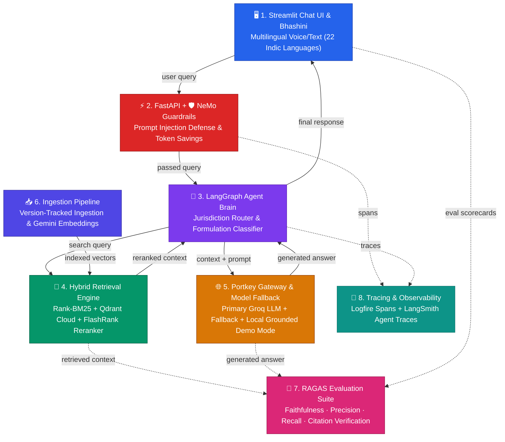

# IP-SAKTI Sahayak: Auditable Multilingual Regulatory & IP Intelligence Platform for Ayurveda
## SIH 2026 Problem Statement ID: 26045

> **Core Positioning:** *"From formulation to compliance: one intelligent, source-grounded platform for navigating Ayurveda-related IP and regulatory complexity."*

---

## 🏛️ System Architecture Overview (Vibrant Color Theme)

```mermaid
graph LR

    %% ── Interfaces ───────────────────────────────────────────────────────────
    subgraph UI ["🖥️ Interface Layer"]
        direction TB
        CHAT["Streamlit\nChat UI & Trust Panel"]
        EVAL_UI["Streamlit\nEval App"]
        BHASHINI["🌐 Bhashini & IndicTrans2\nMultilingual Voice & Text"]
    end

    %% ── API + Safety ─────────────────────────────────────────────────────────
    subgraph SAFETY ["🛡️ API & Safety Layer"]
        direction TB
        API["⚡ FastAPI\n/query Endpoint"]
        GR{"NeMo Guardrails\nPrompt Injection Filter"}
    end

    %% ── LangGraph Agentic Core ────────────────────────────────────────────────
    subgraph AGENT ["🧠 LangGraph Agentic Brain"]
        direction TB
        ROUTER["⚖️ Jurisdiction Router\nDomestic vs International"]
        CLASS["🧪 Formulation Classifier\nClassical vs Proprietary"]
        RT["🔍 Retriever Node\nHybrid Lexical + Vector"]
        RS["💬 Responder Node\nGrounded Answer Synthesis"]
        MEM[("💾 MemorySaver\nChat History")]
    end

    %% ── Retrieval Layer ───────────────────────────────────────────────────────
    subgraph RETRIEVAL ["🔎 Hybrid Retrieval Layer"]
        direction TB
        BM25["🔤 Rank-BM25\nSparse Lexical Search"]
        QD[("🗄️ Qdrant Cloud\nDense Vector DB")]
        FR["⚡ FlashRank\nLocal Reranker"]
    end

    %% ── LLM Gateway & Models ─────────────────────────────────────────────────
    subgraph GATEWAY ["🌐 LLM Gateway & Models"]
        direction TB
        PK["🔀 Portkey Gateway\nUnified Router"]
        G1["🦙 Groq Primary\nLlama 3.3 · 70B"]
        G2["🦙 Groq Fallback\nLlama 3.1 · 8B"]
        VERIFY["✅ Citation & Output Verification\nClaim Support Check"]
    end

    %% ── Ingestion Engine ──────────────────────────────────────────────────────
    subgraph INGEST ["📥 Ingestion Pipeline"]
        direction TB
        LOADER["Statute Loaders\nIndia Code · WIPO · FSSAI"]
        PARSED[("📁 processed_data/\nLegal Chunks")]
        EMB["🔢 Gemini Embeddings\ngemini-embedding-2-preview"]
    end

    %% ── Observability ────────────────────────────────────────────────────────
    subgraph OBS ["📡 Observability & Tracing"]
        direction LR
        LF["🔥 Logfire\nAPI Spans"]
        LS["🦜 LangSmith\nAgent Traces"]
    end

    %% ── Evaluation Suite ─────────────────────────────────────────────────────
    subgraph EVALS ["🧪 RAGAS Evaluation Suite"]
        direction LR
        GD[("📋 Golden Dataset\n500+ QA Pairs")]
        RAGAS["RAGAS Metrics Engine\nFaithfulness · Recall"]
        TC["Citation Check\nVerification Engine"]
        JUDGE["⚖️ Judge LLM\nGroq Pipeline"]
    end

    %% ── Query Dataflow ───────────────────────────────────────────────────────
    CHAT -->|"user query"| API
    BHASHINI -.-> CHAT
    API --> GR
    GR -->|"blocked"| CHAT
    GR -->|"pass"| ROUTER
    ROUTER -->|"conversational"| RS
    ROUTER -->|"regulatory query"| CLASS
    CLASS --> RT
    RT --> BM25
    RT --> QD
    BM25 --> FR
    QD --> FR
    FR --> RS
    RS --> PK
    PK --> G1
    PK -.->|"fallback"| G2
    PK --> VERIFY
    RS -.-> MEM
    MEM -.-> ROUTER

    %% ── Ingestion Dataflow ───────────────────────────────────────────────────
    LOADER --> PARSED
    PARSED --> EMB
    EMB --> QD

    %% ── RAGAS Evaluation Dataflow ────────────────────────────────────────────
    FR -.->|"retrieved contexts"| RAGAS
    RS -.->|"generated answer"| RAGAS
    API -.->|"queries & ground truth"| RAGAS
    EVAL_UI -->|"trigger evals"| API
    GD --> RAGAS
    GD --> TC
    RAGAS --> JUDGE
    RAGAS -->|"eval metrics"| EVAL_UI

    %% ── Observability Traces ─────────────────────────────────────────────────
    API -.->|"spans"| LF
    AGENT -.->|"traces"| LS

    %% ── Vibrant Color Styling ────────────────────────────────────────────────
    classDef ui        fill:#2563EB,stroke:#1E40AF,color:#ffffff
    classDef safety    fill:#DC2626,stroke:#991B1B,color:#ffffff
    classDef agent     fill:#7C3AED,stroke:#5B21B6,color:#ffffff
    classDef retrieval fill:#059669,stroke:#065F46,color:#ffffff
    classDef gateway   fill:#D97706,stroke:#92400E,color:#ffffff
    classDef ingest    fill:#4F46E5,stroke:#3730A3,color:#ffffff
    classDef evals     fill:#DB2777,stroke:#9D174D,color:#ffffff
    classDef obs       fill:#0D9488,stroke:#0F766E,color:#ffffff

    class CHAT,EVAL_UI,BHASHINI ui
    class API,GR safety
    class ROUTER,CLASS,RT,RS agent
    class BM25,QD,FR retrieval
    class PK,G1,G2,VERIFY gateway
    class LOADER,PARSED,EMB ingest
    class GD,RAGAS,TC,JUDGE evals
    class LF,LS obs
```

---

## ⚡ Compact System Flow (Vibrant Color Theme)

